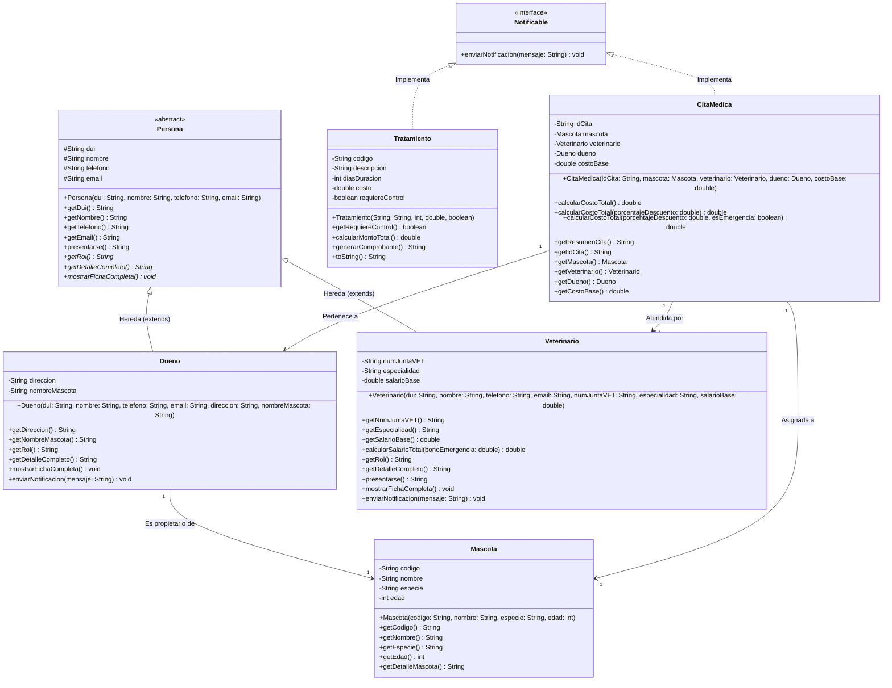

# Diagrama de Clases - Sistema de Gestión de Clínica Veterinaria
**Packege:** `com.uped.veterinaria.modelo` 

```mermaid
classDiagram 
    %% Interfaz propia (Nelson) 
    class Notificable {
        <<interface>>
        +enviarNotificacion(mensaje: String) void
    }

    %% Clase Abstracta Base (Nathaly / Jessie) 
    class Persona {
        <<abstract>>
        #String dui
        #String nombre
        #String telefono
        #String email
        +Persona(dui: String, nombre: String, telefono: String, email: String)
        +getDui() String
        +getNombre() String
        +getTelefono() String
        +getEmail() String
        +presentarse() String
        +getRol()* String
        +getDetalleCompleto()* String
        +mostrarFichaCompleta()* void
    }

    %% Subclases de Persona (Herencia - Jessie) 
    class Dueno {
        -String direccion
        -String nombreMascota
        +Dueno(dui: String, nombre: String, telefono: String, email: String, direccion: String, nombreMascota: String)
        +getDireccion() String
        +getNombreMascota() String
        +getRol() String
        +getDetalleCompleto() String
        +mostrarFichaCompleta() void
        +enviarNotificacion(mensaje: String) void
    }

    class Veterinario {
        -String numJuntaVET
        -String especialidad
        -double salarioBase
        +Veterinario(dui: String, nombre: String, telefono: String, email: String, numJuntaVET: String, especialidad: String, salarioBase: double)
        +getNumJuntaVET() String
        +getEspecialidad() String
        +getSalarioBase() double
        +calcularSalarioTotal(bonoEmergencia: double) double
        +getRol() String
        +getDetalleCompleto() String
        +presentarse() String
        +mostrarFichaCompleta() void
        +enviarNotificacion(mensaje: String) void
    }

    %% Entidades del Dominio Veterinario 
    class Mascota {
        -String codigo
        -String nombre
        -String especie
        -int edad
        +Mascota(codigo: String, nombre: String, especie: String, edad: int)
        +getCodigo() String
        +getNombre() String
        +getEspecie() String
        +getEdad() int
        +getDetalleMascota() String
    }

    class Tratamiento { 
        -String codigo 
        -String descripcion 
        -int diasDuracion 
        -double costo 
        -boolean requiereControl 
        +Tratamiento(String, String, int, double, boolean) 
        +getRequiereControl() boolean 
        +calcularMontoTotal() double 
        +generarComprobante() String 
        +toString() String
    }

    class CitaMedica {
        -String idCita
        -Mascota mascota
        -Veterinario veterinario
        -Dueno dueno
        -double costoBase
        +CitaMedica(idCita: String, mascota: Mascota, veterinario: Veterinario, dueno: Dueno, costoBase: double)
        +calcularCostoTotal() double
        +calcularCostoTotal(porcentajeDescuento: double) double
        +calcularCostoTotal(porcentajeDescuento: double, esEmergencia: boolean) double
        +getResumenCita() String
        +getIdCita() String
        +getMascota() Mascota
        +getVeterinario() Veterinario
        +getDueno() Dueno
        +getCostoBase() double
    }

    %% Relaciones de Herencia (extends) 
    Persona <|-- Dueno : Hereda (extends) 
    Persona <|-- Veterinario : Hereda (extends)

    %% Relaciones de Implementacion (implements) 
    Notificable <|.. Tratamiento : Implementa 
    Notificable <|.. CitaMedica : Implementa

    %% Relaciones de Asociacion 
    Dueno"1" --> "1" Mascota : Es propietario de
    CitaMedica "1" --> "1" Mascota : Asignada a 
    CitaMedica "1" --> "1" Veterinario : Atendida por 
    CitaMedica "1" --> "1" Dueno: Pertenece a
    
    
    

        

```      